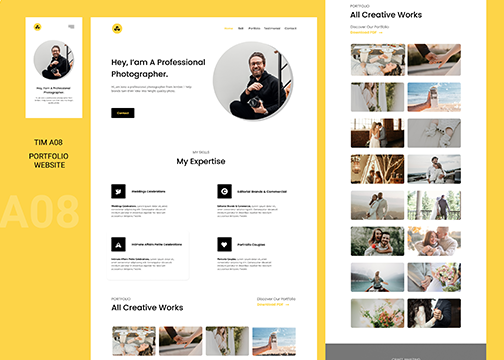

# Proyek Tim A08 Modul HTML & CSS

Website ini dibuat untuk kebutuhan tugas "pembuatan website menggunakan HTML dan CSS" dalam kegiatan bootcamp Anak Teknik Indo & Progate Coding Bootcamp.

## Tema

Tema Webiste yang diambil adalah Portfolio seorang fotografer dengan karakteristik simple dan clean.

## Screenshot

### Links

- Proses Desain URL: [Figma](https://www.figma.com/file/U2rTwRSOjKM6rIqjR3SCIV/Proyek-Tim-Modul-HTML-CSS?node-id=0%3A1)
- Dokumentasi URL: [Google Dokumen](https://docs.google.com/document/d/1mACJsBbQNHraWAM5G0v26_enH0ZCY915QFAnS4t537E/edit#heading=h.31lzmpje6l17)

## Anggota TIM A08

Terdapat 5 orang peserta yang terlibat dalam tim ini, yaitu :

1. Abdul Rohman Sani
2. Adinda
3. Bogie Satria Sakti
4. Faiza Pramudia A
5. Muhamad Sadikin

## Release Date

November 2021

## Version

version 1.0
